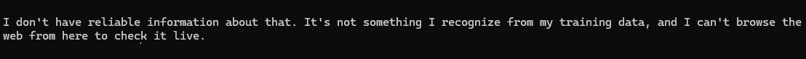

# MagPi

When I'm using an LLM agent harness, the most frustrating thing is asking it something, and then getting hit with the following reply:
<div align="center">
   
</div>

## What is MagPi?

A token-frugal, mostly mechanical, web fetch & search for [pi](https://pi.dev). No API keys, no self-hosting.

MagPi's job is to kill the "I can't look that up" dead end, and cheaply. Everything MagPi fetches becomes part of a local library the model can list, grep, and full-text search, in this session and every one after. The LLM gets a short preview plus a file path; it reads the rest on demand with pi's own `read`/`grep`. Ask about that repo again next week and it comes off disk.

## Install

```bash
pi install npm:pi-magpi        # global
pi install -l npm:pi-magpi     # project-local
```

Or try it without installing: `pi -e npm:pi-magpi`

> The tools are namespaced (`magpi_fetch`, `magpi_search`) so they coexist with other web-access extensions. Already running one? Keep it: MagPi defers to real search tools automatically and sticks to what it's best at, fetching. See "MagPi and pi-web-access" below.

## Tools

### `magpi_fetch`

Throw a URL at it. The first handler that matches wins, and each one knows the smartest way to get that content:

| Handler | URLs | light mode (default) | full mode |
|---|---|---|---|
| `github` | github.com, raw, gists | README + metadata; raw files; issues/PRs with comments | shallow clone into cache |
| `gitlab` | gitlab.com (nested groups too) | README + metadata; raw files | shallow clone into cache |
| `wikipedia` | *.wikipedia.org, wikidata.org | plaintext article extract | - |
| `packages` | npm, PyPI, crates.io, pkg.go.dev, RubyGems, Packagist, Hex, Maven | metadata + readme | download & extract the package into cache |
| `stackexchange` | Stack Overflow, Superuser, *.stackexchange.com | question + top answers | - |
| `reddit` | reddit.com threads | post + top comments | - |
| `hackernews` | news.ycombinator.com items | story + top comments | - |
| `arxiv` | arxiv.org/abs, /pdf | title, authors, abstract | - |
| `webpage` | everything else | readable markdown; PDFs as text; a site's `llms.txt` when published | site docs via `llms-full.txt`, if published |

`full` mode puts files under the cache entry's `tree/` directory. Point pi's `ls`/`read`/`grep` at it. `urls: [...]` batch-fetches up to 5 in parallel.

Fetching a long page to answer a specific question? Pass `topic` and MagPi returns the sections that match, instead of the top of the document, which on a reference page is usually the table of contents. Against Node's 387 KB `fs` docs, `topic: "watch a directory for changes"` comes back with `fs.watch` and `fsPromises.watch`. The model fills this in from the question it is already answering; you never supply keywords. A topic that matches nothing falls back to the head of the page, so a bad guess is never worse than no guess.

### `magpi_cached`

MagPi remembers what it fetched, and makes sure the model does too. This is the library's table of contents: every entry with its URL, kind, age, and local path, covering every past session. Pass `query` and it becomes ranked full-text search over everything ever cached; the model gets the matching sentence plus the file path, and reads the rest from disk. That's about as cheap as recall gets.

### `magpi_search`

This is deliberately a **last resort**, and honest about it. If you have a real search tool installed, or if your LLM has search capabilities, use that for searching. MagPi's job here is only to make sure a keyless, zero-config setup never hits a dead end. It tries DuckDuckGo Lite, then Wikipedia, then HN Algolia, then Context7 (all free rate-limited endpoints; the first source with results wins). When everything fails, MagPi asks *you* to paste results, and tells the model to ask you before answering from stale memory or training data. Feed the URLs it finds to `magpi_fetch`, or pass `fetch_top` to pull the top results into the cache in the same call.

Context7 is last in the rotation on purpose: it only knows libraries, so on a general query it would answer confidently and wrongly. It earns the last slot by being the steadiest of the four when the others are rate-limited. Ask for it by name (`source: "context7"`) to search library and framework documentation directly, which beats a web search for API questions. Its results point at Context7's plaintext endpoint, so `magpi_fetch` caches them like anything else.

The last-resort role is automatic: at session start MagPi looks for other active search tools, and if one exists, tells the model to prefer it by name and treat MagPi as the fallback.

## Beyond the cache

- **Context pruning**: older fetch previews collapse to a one-line pointer before each LLM call. The full text stays on disk. Rewriting an old message costs a prompt cache break, so a pass runs only when the previews it reclaims are worth a large enough share of the context that break invalidates. A small preview in a long conversation is left alone.
- **Cache hints**: paste an already-cached URL into your prompt and the model is pointed straight at the local copy.
- **Promotion**: one entry per URL. Fetching `full` after `light` upgrades that entry in place rather than storing the page twice, and a later `light` request is answered from the `full` copy.
- **Dead links**: a 404 gets the Wayback Machine's latest snapshot, labeled with its capture date.
- **Self-healing**: the search index rebuilds itself from the files at session start whenever something broke it.
- **Accounting**: `/magpi status` reports what the session actually saved: fetches, cache hits, an estimate of the tokens kept out of context, and how many pruning passes it cost. Session numbers live in `status`; what is on disk lives in `cache stats`. Every number is measured from MagPi's own work, with nothing inferred from the model.
- **Always visible**: the cache is real disk, so the TUI footer shows its weight: `🐦 magpi ▸G12 L3 · 40MB |` (entries per cache, `▸` marks where writes go, then total size). An empty cache drops its tag and an empty MagPi drops out of the line entirely, because every extension shares that row.

## MagPi and pi-web-access

Let's be clear about this up front: [pi-web-access](https://github.com/nicobailon/pi-web-access) is a better extension for what it is. A dozen-plus real search providers, LLM-synthesized answers with citations, video understanding, PDFs, blocked-page rescue chains. If you can use pi-web-access (or any real search tool) for searching, you should. Search quality is its game, and MagPi doesn't exist to compete there.

MagPi's game is fetching cheaply. So the ideal setup is both: search with something else, fetch with MagPi. Fetching is where MagPi earns its keep: the cross-session library, structured extractors for a dozen kinds of site, and a public handler API for your own. Searching is where MagPi stays the last resort, there so a keyless setup always has something.

MagPi arranges this split automatically: at session start it looks for other active search tools, and if it finds one, `magpi_search` demotes itself and tells the model to prefer that tool by name. You install both, and each does what it's best at.

## `/magpi` command

```
/magpi help            # reference card: tools, commands, cache paths, config keys
/magpi status          # this session: scope, ttl, budget, cache size, savings, handler list
/magpi cache stats     # what's on disk: per-root totals and recent entries with age
/magpi cache prune     # delete entries older than the ttl
/magpi cache clear
/magpi scope global|project
/magpi ttl <hours>
/magpi max <MB>        # size budget; least-recently-used entries evicted past it (0 = off)
/magpi reindex         # rebuild the search index from the files on disk
/magpi handlers
```

## Configuration

`~/.pi/agent/magpi.json` (global), overridden by `.pi/magpi.json` (project, only when trusted):

```json
{
  "cacheScope": "global",       // where WRITES land: "global" -> ~/.pi/agent/magpi-cache, "project" -> .pi/magpi-cache
  "ttlHours": 24,               // entries older than this are refetched
  "maxCacheMB": 0,              // size budget with LRU eviction; 0 = unlimited
  "allowPrivateNetwork": false  // permit fetching loopback/private addresses (intranet handlers, local dev servers)
}
```

Fetches stick to the public web: loopback, link-local, and private-range addresses are blocked, whether given as IPs or as hostnames that resolve there. Flip `allowPrivateNetwork` when a custom handler needs your intranet. The guard lives in `src/handlers/handler.ts`.

There are two caches, global and project-local, and reads always union both; `cacheScope` picks where new fetches land, and listings tag entries `G`/`L`.

Entries live at readable, host-grouped paths like `magpi-cache/github.com/user-repo-a1b2c3d4/`, each holding `content.md`, `meta.json`, and optionally `tree/`, so a domain's folder is `ls`/`grep`-able as a unit. URLs are canonicalized first (fragments and tracking params dropped, query sorted), so page variants share one entry, and `light` and `full` share it too. Each root also carries `index.db`, the rebuildable search index behind `query` and LRU eviction; `src/cachedb.ts` documents how it works and how it degrades.

## Extending: custom handlers

Got a site MagPi should treat specially? Your blog, your company wiki? Every handler, including MagPi's own, is built from the same `defineHandler` template, so custom ones get the tested default pipeline for free. Register from any other pi extension via pi's shared event bus:

```typescript
// ~/.pi/agent/extensions/my-blog-handler.ts
import type { ExtensionAPI } from "@earendil-works/pi-coding-agent";

export default function (pi: ExtensionAPI) {
  pi.on("session_start", () => {
    pi.events.emit("magpi:register-handler", {
      name: "my-blog",
      description: "My blog, fetched via its JSON API",
      match: (url: URL) => url.hostname === "blog.example.com",
      async fetch(url: URL, ctx: any) {
        const res = await fetch(`https://blog.example.com/api/posts${url.pathname}`, { signal: ctx.signal });
        const post = await res.json();
        return { kind: "article", title: post.title, content: `# ${post.title}\n\n${post.body}` };
      },
    });
  });
}
```

Emit in `session_start` (all extension factories have run by then). Custom handlers are checked before built-ins, so you can shadow any domain. Omit `fetch` entirely to reuse the default GET -> Readability -> markdown pipeline with your own `match`. Handler contract: `{ name, description, match(url), fetch(url, ctx) }`; put downloaded files in `ctx.entryDir/tree` and set `hasTree: true`.

## Development

```bash
npm install
npm test                 # runs test/*.selfcheck.ts: offline checks + live network checks
                         # network.selfcheck.ts skips itself when offline; the live search check does not
pi -ne -e . # try it live
```
